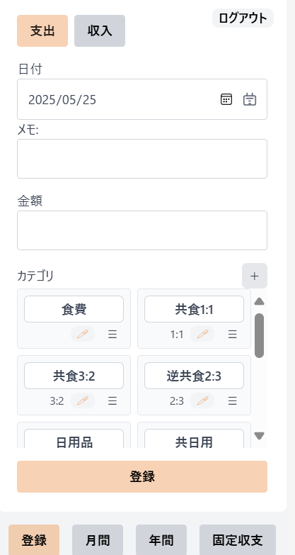
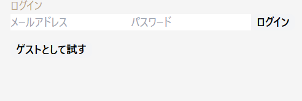
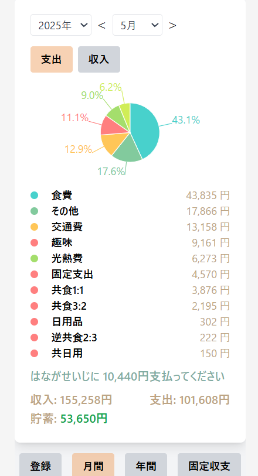
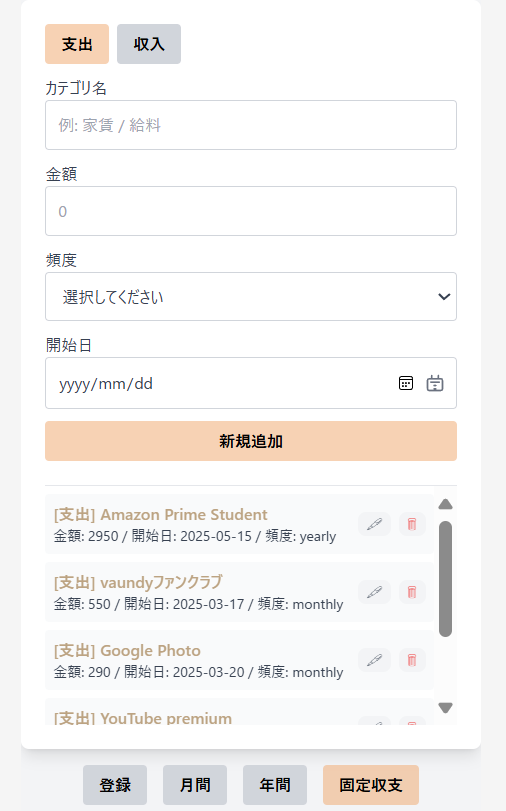
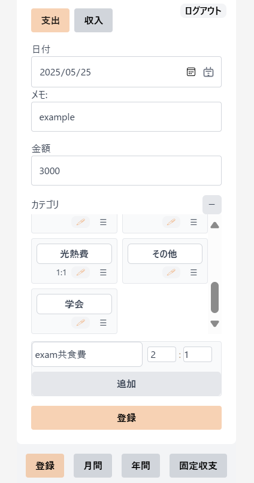
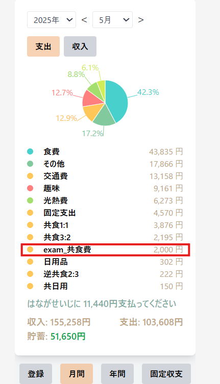
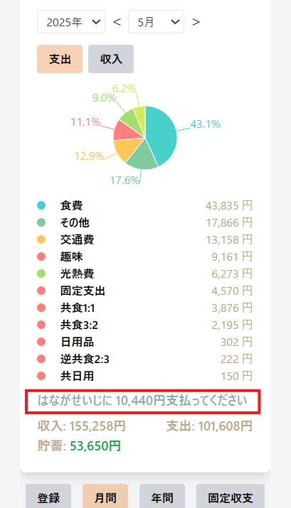

# 同棲用パーソナル家計簿アプリケーション

このアプリは、私個人が同棲生活の管理のために開発した家計簿ウェブアプリケーションです。

## アプリの目的と特徴

一般的な収支登録や月別・年別の家計確認に加え、同棲している2人の金銭管理を簡潔かつ公平に行うことを目的としています。

### 主な特徴

- **収支登録**  
  収入・支出の記録、カテゴリごとの管理  
  

    
  

- **Firebase 認証**  
  ユーザーごとにログイン・管理が可能  
  

    
  

- **月間・年間レポート**  
  各ユーザーの支出傾向を視覚的に確認  
  

    
  

- **固定収支の登録**  
  定期的な家賃・給与などの登録に対応  
  

    
  

- **比率ベースの割り勘**  
  特定のカテゴリ（例: 「共食費(2:1)」）に対して、比率に応じた支出分配が可能  
  例: 3000円の支出 → ユーザAに2000円、ユーザBに1000円を自動で記録  
  

    
  

  

    
  

- **月末の精算メッセージ**  
  支払額に差が出た場合、少なく払った方が差額を支払うよう通知  
  

    
  

このように、一般的な家計簿アプリでは難しい「柔軟な割り勘」や「ユーザー間の自動精算」に特化した設計です。

---

## 使用技術（Tech Stack）

| 分類         | 使用技術 |
|--------------|-----------|
| フロントエンド | React |
| 開発環境     | Vite |
| スタイリング | Tailwind CSS |
| 認証・DB     | Firebase Authentication, Firestore |
| デプロイ     | Vercel |
| CI/CD        | Vercel（GitHub連携による自動ビルド・デプロイ） |

---
